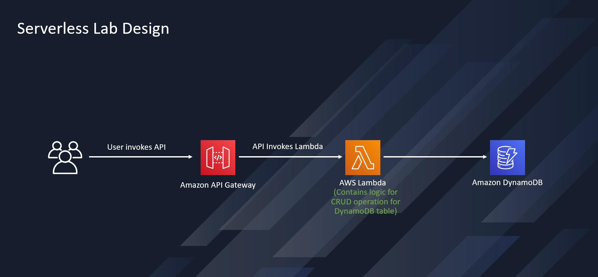

**AWS Lambda Power Tuning**

Welcome to an exciting lab to validate the different configs of a Lambda function to find the best combination between performance and best cost.

What I built is a a simple serverless setup where API GW invokes a lambda that can write to a DynamoDB.

the catch is to use

AWS Lambda Power Tuning is a state machine powered by AWS Step Function that helps optimize lambda function for cost and performance in data driven way. This state machine is programming language agnostic and designed in such a way that its easy to use/deploy and fast to execute.

Now , I did a load test with Postman with virtual users and 3 minutes of testing: the key point is to check the "average response time"

the results 

back to 

the conclusion was that the performance changed a lot when adding memory to the lambda while the cost did not change a lot . I was able to test up to 512M due to free tier of lambda in my AWS account, surely it worth to retest at 1024M to see the difference.

**Takeaways:**
Lambda tuning is not just code optimization but the configurations too.
AWS Lambda Power Tuning comes very handy to know what is the optimal configuration for our lambda.
AWS Pricing calculator also helps to verify these results. (This is not included in this project)
Useful Links: https://serverlessrepo.aws.amazon.com/applications/arn:aws:serverlessrepo:us-east-1:451282441545:applications~aws-lambda-power-tuning

